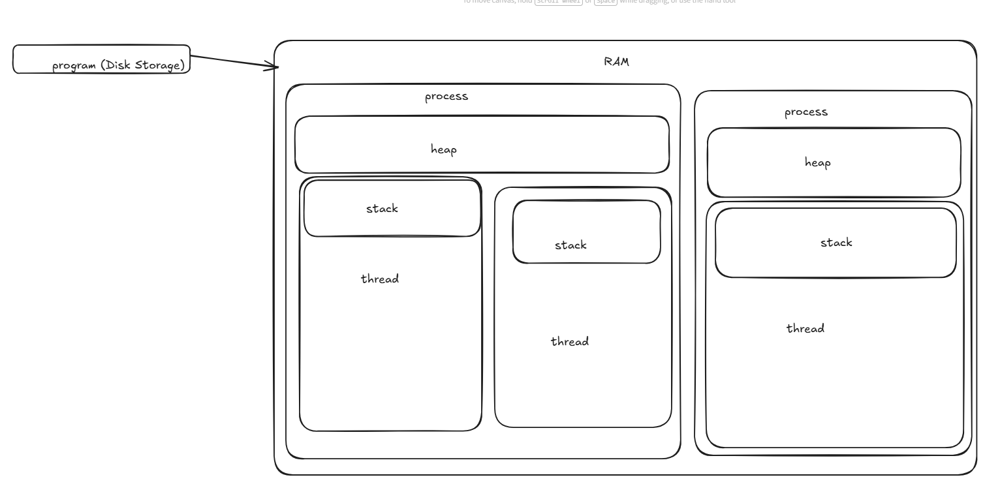

# Async/Await

## Lesson Outline

- Why async programming?
- Syntax is very similar to JS/TS!
  - TS refresher
- C# Example - Tasks vs Promises
- Demo stopwatch
- Composing Tasks w/ `Task.WhenAll()`
  - brief, won't use it much
- Brief intro to threads vs. processes

## Why async programming? (start in LMS or notebook)

- As we've already seen, some operations take a lot of time (think fetch requests, database queries, file operations). It would be a bad thing if our whole program froze while we waited for this slow thing to happen.

## Async/Await in JS/TS

- What happens under the hood is a bit different, but the syntax for async programming is almost identical to TS
- Building on our Generics work from yesterday, we can make an async generic `fetchDataAsync` utility functions

```ts
async function fetchDataAsync<T>(
	url: string,
	options?: RequestInit
): Promise<T> {
	const res = await fetch(url, options && options);
	if (!res.ok) throw new Error('Fetch failed');
	return res.json();
}
```

- We could then use it make an actual request
  - File needs to be a module to use top-level await

```ts
type Duck = {
	_id: string;
	name: string;
	imgUrl: string;
	quote: string;
	createdAt: string;
	updatedAt: string;
	__v: string;
};

const ducks = await fetchDataAsync<Duck[]>(
	'https://duckpond-89zn.onrender.com/wild-ducks'
);
console.log(ducks);

export {};
```

- JS/TS are single threaded (more on threads soon), so they rely on the event loop and their runtime to have async code

## Moving to C#

### Tasks not Promises

- In C# the `Task` class fills the role that `Promises` filled in TS, so a similar example in C# is:
  - `GetStringAsync` will return as a string to save us some overhead with parsing the JSON making a class/record for our ducks (we also won't really be fetching in C#)
  - `await` will pause execution of the next line, but won't block the thread, allowing it to still do other work (such as an API handling multiple incoming requests at once)
  - `await` in top-level statements will make our `Main()` method async
  - when we want to return something, syntax is same as TS

```c#
static async Task<object> FetchDataAsync(string url)
{
  using var httpClient = new HttpClient();
  var data = await httpClient.GetStringAsync(url);
  return data;
}


var ducks = await FetchDataAsync("https://duckpond-89zn.onrender.com/wild-ducks");
Console.WriteLine(ducks);
```

### No return value

- Unlike TS with `Promise<void>` to indicate no return value, in C# we simply write `Task` (not `Task<void>`)
  - we can use `Task.Delay(int ms)` to simulate an async operation

```c#
static async Task DelayedLogAsync(string message)
{
  await Task.Delay(500);
  Console.WriteLine(message);
}

await DelayedLogAsync("Delayed hello");
```

- if we don't `await`, execution is not paused (we'll even get a warning about it)

```c#
static async Task DelayedLogAsync(string message)
{
  Task.Delay(500);
  Console.WriteLine(message);
}
```

## Exception handling

- Errors get propagated (pass up through) their `Task`. What that means for us, is we can handle them like we do sync errors - with a `try/catch` block

```c#
static async Task DelayedLogAsync(string message)
{
  await Task.Delay(500);
  throw new NotImplementedException("You didn't write this yet?");
  Console.WriteLine(message);
}
Console.WriteLine("Hello");
try
{

  await DelayedLogAsync("Delayed hello");
}
catch (Exception ex)
{
  Console.WriteLine($"Error: {ex.Message}");
}
```

## Multiple async operations

### Timing our application

- We can use the `System.Diagnostics` namespace to make a stopwatch and actually time our application

```c#
using System.Diagnostics;

 var stopWatch = Stopwatch.StartNew();
  Console.WriteLine("Hello");
  Console.WriteLine($"Sync elapsed: {stopWatch.ElapsedMilliseconds} ms\n");

  await DelayedLogAsync("Delayed hello");

  Console.WriteLine($"Async elapsed: {stopWatch.ElapsedMilliseconds} ms\n");
```

- We're a little over 500ms, just as we'd expect. If we add a second message, we should expect to be around 1000ms (1 second)

```c#
  var stopWatch = Stopwatch.StartNew();
  Console.WriteLine("Hello");
  Console.WriteLine($"Sync elapsed: {stopWatch.ElapsedMilliseconds} ms\n");

  await DelayedLogAsync("Delayed hello");
  await DelayedLogAsync("Another Delayed hello");

  Console.WriteLine($"Async elapsed: {stopWatch.ElapsedMilliseconds} ms\n");
```

- Since it's the `await` keyword that pauses execution, if we don't `await` right away, we can improve our execution time

```c#
var stopWatch = Stopwatch.StartNew();
  Console.WriteLine("Hello");
  Console.WriteLine($"Sync elapsed: {stopWatch.ElapsedMilliseconds} ms\n");

  var firstTask = DelayedLogAsync("Delayed hello");
  await DelayedLogAsync("Another Delayed hello");
  await firstTask;

  Console.WriteLine($"Async elapsed: {stopWatch.ElapsedMilliseconds} ms\n");
```

### Composing Tasks

- A better option when you want task to run in parallel is to use `Task.WhenAll()`
- If we wanted to have several fetch calls run at the same time, we could do the following

```c#
var stopWatch = Stopwatch.StartNew();
  Console.WriteLine("Hello");
  Console.WriteLine($"Sync elapsed: {stopWatch.ElapsedMilliseconds} ms\n");

  // var firstTask = DelayedLogAsync("Delayed hello");
  // await DelayedLogAsync("Another Delayed hello");
  // await firstTask;

  var tasks = new[] { DelayedLogAsync("Delayed hello"), DelayedLogAsync("Another Delayed hello") };
  await Task.WhenAll(tasks);

  Console.WriteLine($"Async elapsed: {stopWatch.ElapsedMilliseconds} ms\n");
```

- There is also `Task.WhenAny()` to give more granular control over handling each async task individually. If you're curious, you can look deeper, but we won't really be working with it (use case for where we're headed could be if you need to make multiple database calls in a single API endpoint request)

## So what are Threads anyway?

- We've talked quite a bit about threads, and while it's not necessary to have a deep understanding of the theory to work with `async/await`, it will help you in the long run to write cleaner code (and the difference between a thread and a process is a famous interview question)

### What is a program?

- To start, we need to first define what a program is - any thoughts?
  - code stored on your computer to do a task
  - saved on Disk Storage
  - we often use the word "application" for programs that we interact with
  - anything from Chrome to Slack to our CLI apps or simple scripts are programs

### What is a process? - thoughts?

- In order for a program to run, it needs to be loading into memory (RAM) in order to actually run
- A program can have several processes
- Each process has it's own space in memory, so it's own stack and heap. This means that one process crashing doesn't effect another
- You can see processes on the _Task Manager_ for Windows or _Activity Monitor_ on mac (open and show)
- Chrome famously has a separate process for each tab

### What is a thread then? - thoughts?

- A thread is a unit of execution within a process. JS is single threaded, C# is multi-threaded
- Each thread has it's own stack, but share the same heap
- This makes them cheaper than full processes, and more efficient communication between threads than processes
- Downside is if one thread goes down, it interrupts the whole process
- Though less expensive than processes, the benefit of `async/await` is that it frees up a thread to do other work, instead of spinning up a new thread


